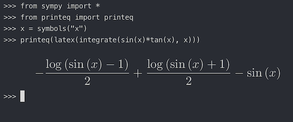

# printtex

Small script that prints a rendered latex equation to the output in a supported terminal emulator (currently only supports iterm2). I created the python module as a shorthand to viewing latex output of `Sympy.latex()` in a python terminal session.

## Installation

Requires working installation of latex, imagemagick, and imgcat.
* To install just the script, simply add `bin/printeq` to your PATH.
* To install the python wrapper along with the script, run `pip install printeq`

## Example Usage

